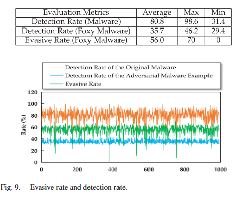
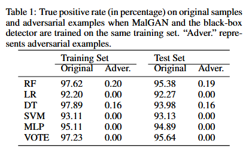
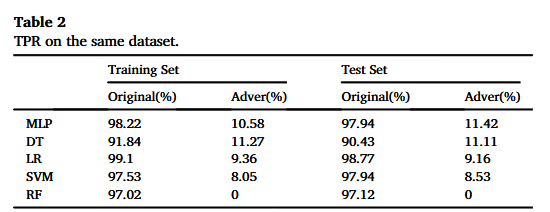
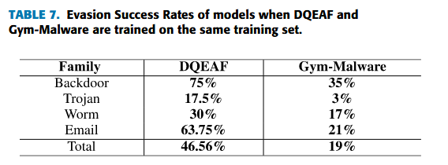
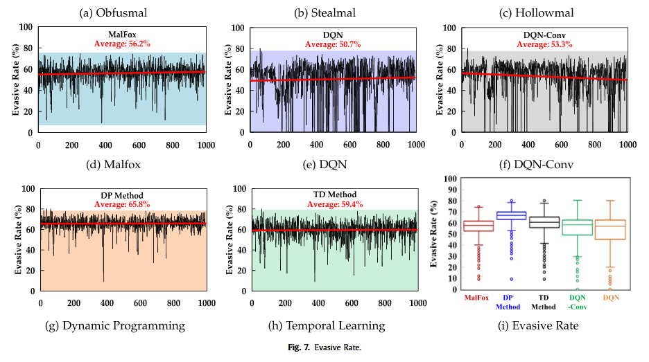
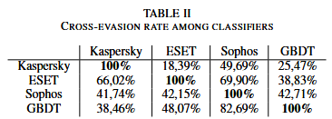
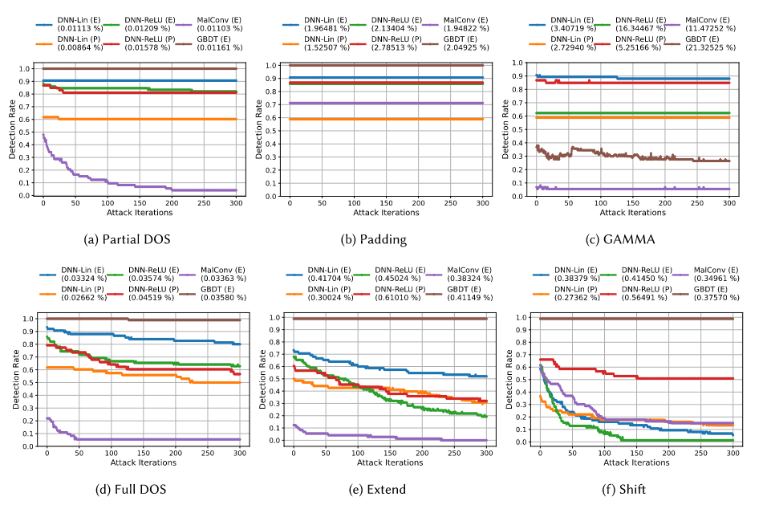
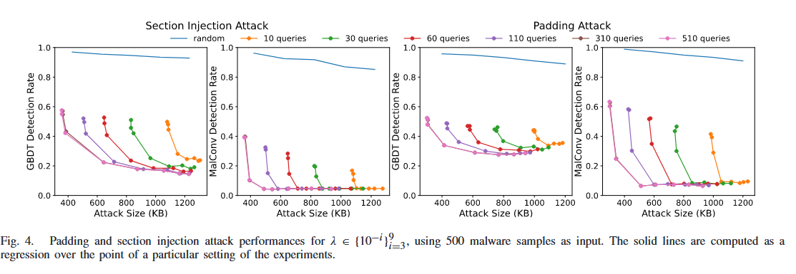
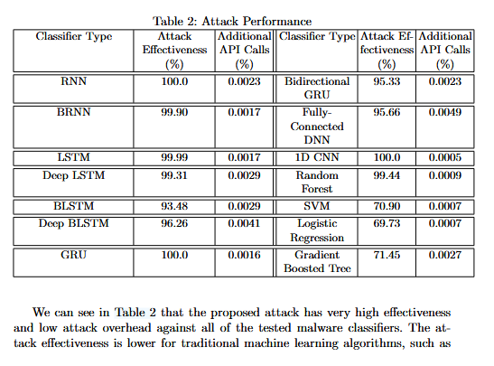

# Models and frameworks

## GAN model frameworks

- MalFox (✅ VirusTotal)
  - 
- MalGAN (❌ Academia models)
  -  TPR is not the best metric, as we care about FP too
- N-gram MalGAN (❌ Academia models)
  - 
- InfoGAN 
  - This is not an adversarial framework - it's a way to force GANs to include mutual information into sample generation

## RL model frameworks

- DQEAF (❌ GBDT)
  - 
- MalInfo (✅ VirusTotal)
  - 

## Genetic algorithm frameworks

- AIMED (✅ Commercial & GBDT)
  - 
- RAMEN (❌ MalConv)
  - 
- GAMMA (❌ MalConv & GBDT)
  - 

## Other frameworks

- GADGET (❌ Academia models)
  - 

## Detector models

- MalConv
- GBDT
